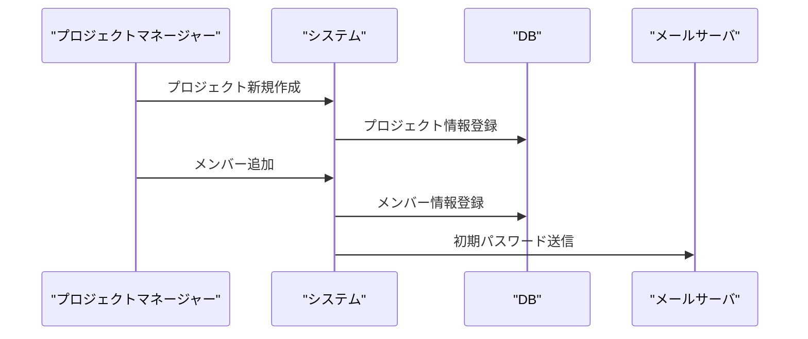
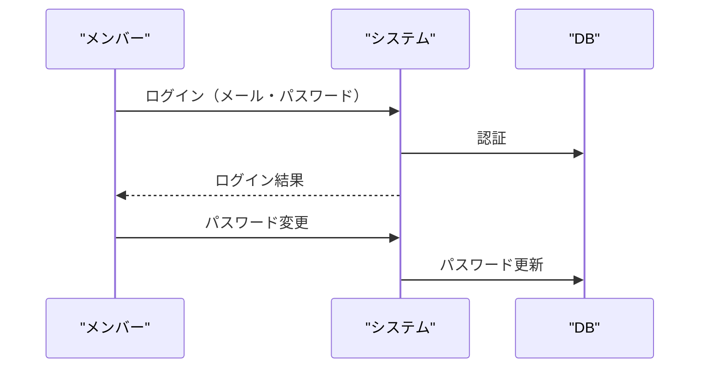
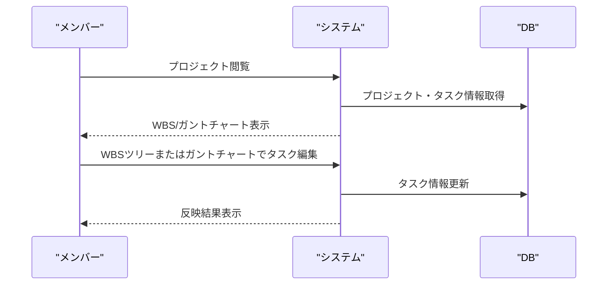
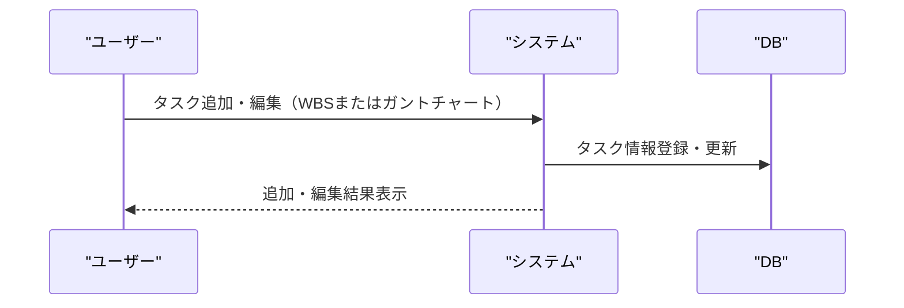

# 基本設計書

## 1. システム構成

- フロントエンド：Next.js（API Route 利用、shadcnui 採用）
- バックエンド：Next.js API Route
- データベース：Azure Cosmos DB（NoSQL）
- メール送信：Azure Communication Service
- 認証：JWT（パスワードは暗号化保存）
- デプロイ：Azure Web Apps、GitHub Actions による CI/CD

## 2. データベース設計（概要）

- プロジェクトごとに「タスクコレクション」を持ち、WBS とガントチャートは同一データを参照・操作
- タスクは親子関係（parentId）、依存関係（dependencies: [taskId]）、日付、進捗、担当者などを持つ
- 階層構造・ノード構造・ガント情報を 1 つの構造体で一元管理
- プロジェクトごとにユーザー権限（管理者/一般）を管理

## 3. メール送信

- Azure Communication Service のメール API を利用し、ユーザー招待・初期パスワード送信を実装

## 4. 業務フロー（業務ごとに分割した Mermaid シーケンス図）

### 4.1 プロジェクト作成・メンバー招待

### 4.2 メンバーの初回ログイン・パスワード変更

### 4.3 プロジェクト閲覧・WBS/ガントチャート操作

### 4.4 タスク追加・編集（WBS ツリー・ガントチャート両対応）

## 5. 主要画面・機能構成

1. ログイン画面（メール・パスワード、パスワードリセット）
2. ダッシュボード（参加プロジェクト一覧、プロジェクト新規作成）
3. プロジェクト詳細（WBS ツリー表示・編集、ガントチャート表示・編集、メンバー管理）
   - WBS ツリーとガントチャートは同一データを参照し、どちらからでもタスク追加・編集が可能
   - 片方での操作は即座にもう一方へ反映
4. ユーザー管理（ユーザー一覧・招待・削除、プロフィール編集）
5. エクスポート・インポート（PDF/画像エクスポート、JSON/CSV エクスポート・インポート）

## 6. 権限設計

- 管理者：プロジェクト新規追加、メンバー管理、招待、プロジェクト閲覧・編集・削除
- 一般ユーザー：招待プロジェクトの閲覧、タスクの更新・編集・削除

## 7. その他

- WebSocket によるリアルタイム同期・同時編集
- PWA 対応、レスポンシブデザイン
- セキュリティ・拡張性は詳細設計で検討
