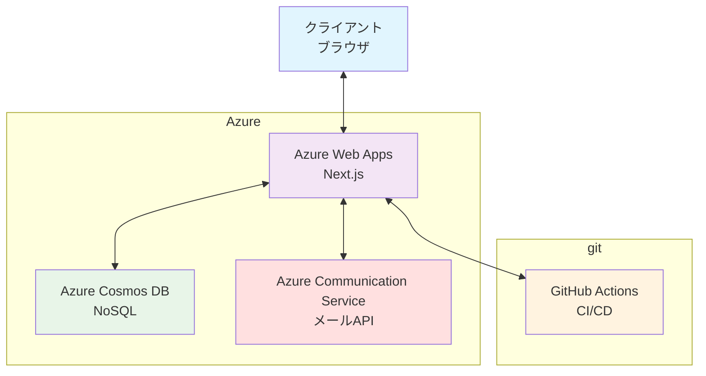

# WBS・ガントチャート管理アプリ 詳細設計書

## 1. システム概要

### 1.1 システム名

WBS・ガントチャート管理アプリ

### 1.2 設計方針

- **アーキテクチャ**：Next.js App Router + API Routes
- **データベース**：Azure Cosmos DB（NoSQL）
- **デプロイ**：Azure Web Apps + GitHub Actions
- **パッケージマネージャー**：pnpm
- **テスト**：pnpm vitest + pnpm storybook + pnpm playwright
- **UI**：shadcnui
- **リアルタイム**：WebSocket
- **メール送信**：Azure Communication Service

### 1.3 システム構成図



## 2. アーキテクチャ設計

### 2.1 技術スタック詳細

- **フロントエンド**：Next.js 15（App Router）、TypeScript、Tailwind CSS、shadcnui
- **状態管理**：Zustand
- **UI コンポーネント**：shadcnui
- **バックエンド**：Next.js API Routes、Cosmos DB、JWT 認証
- **リアルタイム**：WebSocket
- **メール送信**：Azure Communication Service
- **CI/CD**：GitHub Actions

### 2.2 ディレクトリ構成（例）

```
src/
├── app/                    # Next.js App Router
│   ├── (auth)/            # 認証関連ページ
│   ├── dashboard/         # ダッシュボード
│   ├── project/           # プロジェクト詳細（WBS/ガントチャート）
│   ├── user/              # ユーザー管理
│   ├── export/            # エクスポート・インポート
│   ├── api/               # API Routes
│   │   ├── project/       # プロジェクトAPI
│   │   ├── task/          # タスクAPI
│   │   ├── user/          # ユーザーAPI
│   │   └── export/        # 出力API
│   ├── globals.css        # グローバルスタイル
│   ├── layout.tsx         # ルートレイアウト
│   └── page.tsx           # ホームページ
├── components/            # 共通コンポーネント
│   ├── ui/               # UI コンポーネント
│   ├── forms/            # フォームコンポーネント
│   ├── gantt/            # ガントチャート関連
│   ├── wbs/              # WBSツリー関連
│   └── layout/           # レイアウトコンポーネント
├── lib/                  # ユーティリティ
│   ├── database/         # データベース関連
│   ├── utils/            # 共通ユーティリティ
│   ├── validations/      # バリデーション
│   ├── constants/        # 定数
│   └── config/           # 設定ファイル
├── types/                # TypeScript型定義
├── hooks/                # カスタムフック
└── stores/               # Zustandストア
```

## 3. データベース設計

### 3.1 データモデル詳細

#### 3.1.1 プロジェクト（Project）

```typescript
interface Project {
  id: string; // プロジェクトID
  name: string; // プロジェクト名
  description: string; // プロジェクト概要
  members: string[]; // 参加ユーザーID配列
  createdAt: Date;
  updatedAt: Date;
}
```

#### 3.1.2 タスク（Task）

```typescript
interface Task {
  id: string; // タスクID
  projectId: string; // プロジェクトID
  parentId: string | null; // 親タスクID（ルートはnull）
  title: string; // タスク名
  description: string; // 概要（Markdown対応）
  startDate: string; // 開始日（ISO8601）
  endDate: string; // 終了日（ISO8601）
  progress: number; // 進捗率（0-100）
  dependencies: string[]; // 依存タスクID配列
  assignee: string; // 担当者ユーザーID
  attributes: Record<string, any>; // 任意属性（グルーピング等）
  createdAt: Date;
  updatedAt: Date;
}
```

#### 3.1.3 ユーザー（User）

```typescript
interface User {
  id: string; // ユーザーID
  email: string; // メールアドレス
  name: string; // 氏名
  role: "admin" | "member"; // 権限
  projects: string[]; // 参加プロジェクトID配列
  createdAt: Date;
  updatedAt: Date;
}
```

### 3.2 Cosmos DB 設定

- データベース名：`gantt-wbs-app`
- コンテナ：
  - `projects`：プロジェクト
  - `tasks`：タスク（WBS/ガントチャート共通）
  - `users`：ユーザー
- パーティションキー：
  - `projects`：`/id`
  - `tasks`：`/projectId`
  - `users`：`/id`

## 4. API 設計

### 4.1 RESTful API 設計

#### 4.1.1 プロジェクト管理 API

```
GET    /api/project            # プロジェクト一覧取得
POST   /api/project            # プロジェクト作成
GET    /api/project/[id]       # プロジェクト詳細取得
PUT    /api/project/[id]       # プロジェクト更新
DELETE /api/project/[id]       # プロジェクト削除
```

#### 4.1.2 タスク管理 API

```
GET    /api/task?projectId=    # プロジェクト内タスク一覧取得
POST   /api/task               # タスク作成
GET    /api/task/[id]          # タスク詳細取得
PUT    /api/task/[id]          # タスク更新
DELETE /api/task/[id]          # タスク削除
```

#### 4.1.3 ユーザー管理 API

```
GET    /api/user               # ユーザー一覧取得
POST   /api/user               # ユーザー作成
GET    /api/user/[id]          # ユーザー詳細取得
PUT    /api/user/[id]          # ユーザー更新
DELETE /api/user/[id]          # ユーザー削除
```

#### 4.1.4 エクスポート・インポート API

```
POST   /api/export/pdf         # ガントチャートPDF出力
POST   /api/export/image       # ガントチャート画像出力
POST   /api/export/json        # プロジェクトデータJSON出力
POST   /api/export/csv         # プロジェクトデータCSV出力
POST   /api/import/json        # プロジェクトデータJSONインポート
POST   /api/import/csv         # プロジェクトデータCSVインポート
```

### 4.2 API レスポンス形式

```typescript
interface ApiResponse<T> {
  success: true;
  data: T;
  message?: string;
}

interface ApiError {
  success: false;
  error: {
    code: string;
    message: string;
    details?: any;
  };
}
```

## 5. 主要画面設計

### 5.1 画面遷移図

```
ホーム
  ├── ダッシュボード
  │   ├── プロジェクト詳細
  │   │   ├── WBSツリー/ガントチャート（同一データ）
  │   │   └── メンバー管理
  │   └── エクスポート・インポート
  └── ユーザー管理
```

### 5.2 画面詳細設計

#### 5.2.1 ログイン画面

- メールアドレス・パスワード入力
- パスワードリセット

#### 5.2.2 ダッシュボード

- 参加プロジェクト一覧
- プロジェクト新規作成

#### 5.2.3 プロジェクト詳細

- WBS ツリー表示・編集（タスク階層管理、追加・削除・移動）
- ガントチャート表示・編集（期間・進捗・依存関係編集、ドラッグ操作）
- WBS ツリーとガントチャートは同一データを参照し、どちらからでも編集可能
- メンバー管理（招待・削除・権限変更）

#### 5.2.4 ユーザー管理

- ユーザー一覧・招待・削除
- プロフィール編集

#### 5.2.5 エクスポート・インポート

- PDF/画像エクスポート
- JSON/CSV エクスポート・インポート

---

## 6. セキュリティ設計

### 6.1 認証・認可

- JWT（JSON Web Token）による認証・認可を実装
- JWT の有効期限は 30 日とし、`exp`クレームで管理
- パスワードは bcrypt 等でハッシュ化して保存
- API Route ごとに認可チェック（管理者・一般ユーザー権限）
- プロジェクトごとにアクセス権限を厳格に管理
- 長期トークン運用のため、ログアウト時のトークン無効化やリフレッシュトークン運用も推奨

### 6.2 通信の安全性

- 全通信を HTTPS で暗号化
- WebSocket も WSS（TLS）で運用

### 6.3 入力値検証・サニタイズ

- API 受信時に型・値検証（zod 等でバリデーション）
- XSS/SQL インジェクション対策（Cosmos DB は NoSQL だが、クエリインジェクションも考慮）
- Markdown レンダリング時は XSS 対策を徹底

### 6.4 セッション・トークン管理

- JWT の有効期限・リフレッシュトークン運用
- ログアウト時のトークン無効化

### 6.5 ログ・監査

- 重要操作（認証、データ変更、エクスポート等）は監査ログとして記録
- 管理者のみが監査ログを閲覧可能

### 6.6 メール送信

- 招待メール・パスワードリセットメールはワンタイムトークンを利用
- メール本文に個人情報やパスワードを直接記載しない

---

## 7. パフォーマンス設計

### 7.1 フロントエンド

- Next.js の SSR/SSG を活用し初期表示を高速化
- 必要に応じてクライアントサイドキャッシュ（Zustand, SWR 等）
- コンポーネントの遅延ロード（Dynamic Import）

### 7.2 バックエンド/API

- Cosmos DB のパーティション設計でクエリ効率化
- 必要なデータのみを返す API 設計（ページネーション、フィールド選択）
- 重い処理は非同期化・バッチ化

### 7.3 リアルタイム同期

- WebSocket 通信は差分のみ送信し、帯域を最適化
- クライアント側での最小限の再描画

### 7.4 エクスポート・インポート

- 大規模データのエクスポートはストリーミング処理
- インポート時はバリデーション・重複チェックを効率化

---

## 8. テスト設計

### 8.1 テスト方針

- ユニットテスト：主要ロジック・API・DB アクセス（vitest）
- コンポーネントテスト：UI コンポーネント単体（storybook）
- E2E テスト：主要画面・業務フロー（playwright）
- API テスト：API Route ごとに正常系・異常系

### 8.2 テストカバレッジ

- 重要機能（認証、タスク追加・編集、エクスポート等）は 100%カバーを目標
- CI/CD で自動テスト実行・カバレッジ計測

### 8.3 テストデータ管理

- テスト用 Cosmos DB インスタンスを用意
- テストデータは自動生成・クリーンアップ

---

## 9. 設定管理

### 9.1 環境変数管理

- .env ファイルで API キー・DB 接続情報・メール設定等を管理
- 機密情報は Azure Key Vault 等のシークレット管理サービスも活用
- Azure Web Apps（App Service）では「アプリケーション設定（Application Settings）」で環境変数を GUI や CLI から簡単に設定・上書き可能
- Azure 上のアプリケーション設定は、Node.js/Next.js アプリの`process.env`として自動的に参照されるため、本番環境での安全な運用が可能
- ローカル開発では.env、本番では Azure アプリケーション設定を利用し、リポジトリに機密情報を含めない運用とする

### 9.2 設定ファイル

- `src/lib/config/`配下に各種設定ファイル（API エンドポイント、定数等）を配置
- 設定値は型安全に管理（TypeScript 型定義）

### 9.3 CI/CD 設定

- GitHub Actions でビルド・テスト・デプロイを自動化
- 環境ごと（dev/stg/prod）に設定を分離

---

## 10. 時刻・タイムゾーン設計

- 本システムは日本国内利用を前提とし、全ての時刻情報は JST（日本標準時、UTC+9）で統一します。
- データベース保存時、API レスポンス、画面表示、ガントチャート・WBS の期間管理等、全て JST 基準で運用します。
- サーバーサイド・クライアントサイドともに、日付・時刻のパース・フォーマット時は JST を明示的に指定します。
- 必要に応じて、ISO8601 形式（例：2024-06-01T09:00:00+09:00）で JST タイムゾーンを付与して保存・通信します。

---

この後、セキュリティ設計・パフォーマンス設計・テスト設計・デプロイ設計・運用設計・設定管理・リスク対策も追記可能です。ご要望があればご指示ください。
