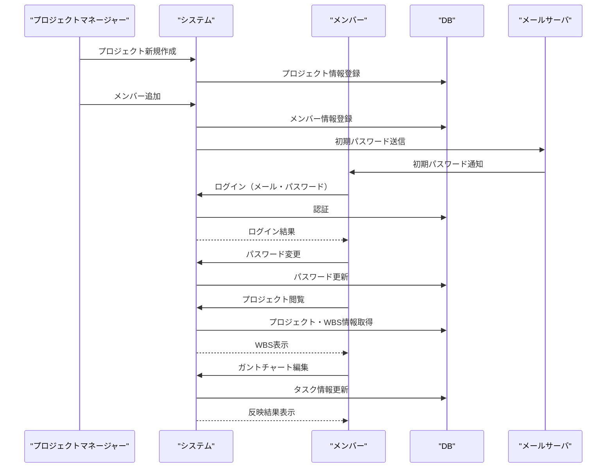

## 提案内容。

### 1. DB 候補のご提案

Next.js（API Route）＋リアルタイム・同時編集に強い DB の候補は以下です。

- **Firebase Realtime Database / Firestore**
  - Google 提供。リアルタイム同期・同時編集に強い。Next.js との親和性も高い。
  - 無料枠あり。Azure との連携も可能。
- **Supabase**
  - オープンソースの Firebase 代替。PostgreSQL ベースでリアルタイム機能（WebSocket）あり。
  - Next.js との統合も容易。セルフホストやクラウド選択可。
- **MongoDB Atlas + Change Streams**
  - NoSQL。Change Streams でリアルタイム通知が可能。
  - Next.js との連携も多い。
- **Azure Cosmos DB**
  - Azure ネイティブ。NoSQL/SQL 両対応。リアルタイム性・スケーラビリティに優れる。
  - Azure Web Apps との親和性が高い。

ご希望やご質問があればお知らせください。特に Azure との統合性を重視する場合は「Cosmos DB」、開発スピードやコミュニティを重視する場合は「Supabase」や「Firebase」がおすすめです。

---

### 2. 業務フロー（Mermaid シーケンス図）

---

### 3. 必要画面・機能構成案

1. **ログイン画面**

   - メールアドレス・パスワード入力
   - パスワードリセット

2. **ダッシュボード**

   - 参加プロジェクト一覧
   - プロジェクト新規作成（管理者のみ）

3. **プロジェクト詳細画面**

   - WBS ツリー表示・編集
   - ガントチャート表示・編集
   - メンバー管理（管理者のみ）

4. **ユーザー管理画面**

   - ユーザー一覧・招待・削除（管理者のみ）
   - プロフィール編集

5. **エクスポート・インポート画面**
   - PDF/画像エクスポート
   - JSON/CSV エクスポート・インポート

レビュー内容

DB に関して、今回ノード（タスク間の繋がり）がありネストする可能性があるのですが、それでもその DB 群になりますか？
管理方法も併せて考えてください。

メールサーバーについては、Azure Communication Service のメール送信機能を使いたいです。

シーケンス図ですが、すべてを一つに書く必要はなく、いくつかの業務があるので業務毎にわけて作成してください。

タスクの追加はガントチャート側でもできるし、WBS のツリー側でも行う想定です。
